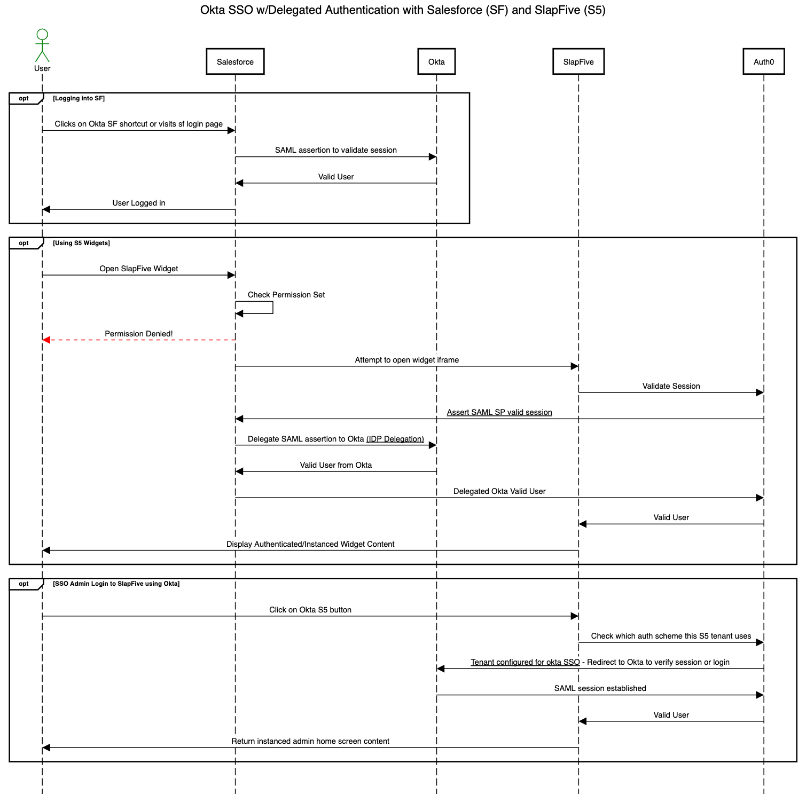

# Use Okta for SSO for Salesforce users

### Why Delegated Authentication is necessary

The SlapFive Salesforce App is a Salesforce embedded application, so it must authenticate with Salesforce to validate that a user has application level permissions (Authorization) and is a valid legal user of Salesforce (Authentication).&#x20;

Using SAML terminology, the SlapFive Salesforce App is a subservient Service Provider (SP) which gets its authentication and authorization from its only known upstream Identity Provider (IDP) which is Salesforce.&#x20;

If your company uses Okta as the IDP to provide SSO login for Salesforce users, the SlapFive Salesforce App must also use Okta as the IDP, which means your Salesforce org must be configured to delegate embedded apps authentication to Okta.

### Delegated Authentication data flow

This data flow diagram shows how the delegated authentication works with Okta, Salesforce, and SlapFive.

<figure><figcaption>
Delegated Authentication data flow diagram
</figcaption></figure>

### Configuring Delegated Authentication

See [this article](https://saml-doc.okta.com/SAML_Docs/How-to-Configure-SAML-2.0-in-Salesforce.html#del-auth) from Okta's documentation site for instructions on how to configure Delegated Authentication.
