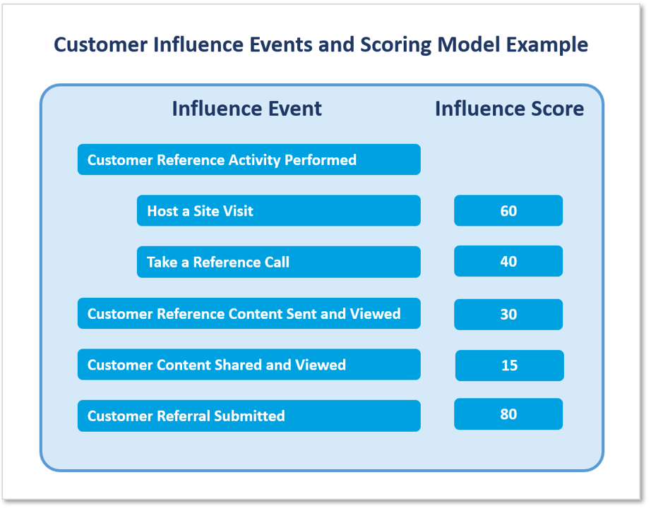

# Salesforce

## Overview of SlapFive's Salesforce Integration

<figure><figcaption>
Overview of SlapFive Salesforce App and Integration
</figcaption></figure>

SlapFive's Salesforce Integration has two major parts:

* [The SlapFive Salesforce App](./#the-slapfive-salesforce-app) - a native Salesforce app for showing SlapFive features and content within Salesforce
* [SlapFive-Salesforce Data Synchronization](synchronize-data-between-salesforce-and-slapfive/) - bi-directional data synchronization between SlapFive and Salesforce objects.


**Good to know:** The SlapFive Salesforce App is installed using a Managed Package. The Salesforce App is not needed to synchronize data between Salesforce Account and Contact records and SlapFive Member and Company objects.


## The Salesforce/SlapFive Data Model

This diagram will give you an overview of the relationship between the Salesforce and SlapFive Data Models, as well as the Salesforce custom objects and data synchronization flows.

<figure><figcaption>
Salesforce/SlapFive Data Model
</figcaption></figure>

## The SlapFive Salesforce App

The SlapFive Salesforce App contains:

* [Custom UI Component](./#custom-ui-component) - for enabling Salesforce users to access SlapFive content and features.
* [Custom Objects and Fields](./#custom-objects) - for associating revenue influence events with Opportunities, Contacts, and Accounts.
* [Custom Reports and Dashboard](./#custom-reports-and-dashboard) - for reporting on customer influence on revenue, renewals, length of sales cycle, and deal size.

### Custom UI Component

The **SlapFive Reference Customers and Content** custom UI component is designed to give your Salesforce users quick and easy access to the most relevant SlapFive Boards and Stories, see recommended Reference Companies and Contacts, and **Request References**:

<figure><figcaption>
SlapFive Reference Customers and Content custom UI component
</figcaption></figure>

This UI component includes 4 tabs, which can be [configured to show/hide, sequence, and filter the content on each tab](slapfive-advanced-app/5.-configure-the-custom-ui-component.md). Here is what Salesforce users can do on each tab:

#### View Companies

* See recommended reference Companies (SlapFive Companies) based on matching criteria between the Opportunity and Account and the SlapFive Companies.
* Click the Filter button to relax the filter criteria used by the matching criteria to see more Companies, and select additional filter criteria to further refine the list.
* Select one or more Companies to request as references and click the **Request References** button to [submit reference requests](./#submit-reference-requests).
* Use the **Search** field to narrow down the list of records.
* Click a Company name to see the details tray with more fields for that Company.

#### View Contacts

* See recommended reference Contacts (SlapFive Members) based on matching criteria between the Opportunity and Account and the Companies that the SlapFive Members belong to.
* Click the Filter button to relax the filter criteria used by the matching criteria to see more Contacts, and select additional filter criteria to further refine the list.
* Select one or more Contacts to request as references and click the **Request References** button to [submit reference requests](./#submit-reference-requests).
* Use the **Search** field to narrow down the list of records.
* Click a Contact name to see the details tray with more fields for that Contact.

#### View Boards

* See the list of Boards that have been flagged to appear in Salesforce.
* Click the Board name to see the details tray with more fields for that Board.
* Click the Preview menu next to a Board to open and view that Board in a new tab.
* Click the Share menu next to a Board to [share that Board with one or more prospects](./#share-customer-content-with-prospects), by selecting Contact Roles for the Opportunity or other people entered directly into the Share screen.

#### View Stories

* See the list of Stories that have been flagged to appear in Salesforce.
* Click the Story name to see the details tray with more fields for that Story.
* Click the Preview menu next to a Story to open and view that Story in a new tab.
* Click the Share menu next to a Board to [share that Story with one or more prospects](./#share-customer-content-with-prospects) by selecting Contact Roles for the Opportunity or other people entered directly into the Share screen.&#x20;

### Custom Objects

The SlapFive Salesforce App installs three custom objects:

1. SlapFive Customer Influence
2. SlapFive Customer Influence Activity
3. SlapFive Customer Activity

The **SlapFive Customer Influence** custom object has a Master-Detail relationship with the Opportunity object. An Opportunity record can have zero to many SlapFive Customer Influence records.

The **SlapFive Customer Influence Activity** custom object has a Master-Detail relationship with the SlapFive Customer Influence object. A SlapFive Customer Influence record can have zero to many SlapFive Customer Influence Activity records.

These two objects together are used to [capture revenue influence events](./#track-revenue-influence-events), enable Salesforce users to see the status of those events, associate the events with Salesforce Opportunities, and [report on customer influence on revenue](./#report-on-customer-influence-on-revenue), and they contain the data as shown in this chart.

<table><thead><tr><th width="203">Influence Event</th><th width="246">SlapFive Customer Influence</th><th width="317">SlapFive Customer Influence Activity</th></tr></thead><tbody><tr><td>Reference Request</td><td>The request header: The Need, Need by Date, Activity, Request Date, etc.</td><td>The Request Fulfillment Companies &#x26; Members who have been selected to fulfill the Request.</td></tr><tr><td>Content Share &#x26; View</td><td>The share details: Content shared, Contact shared with, Share Date, etc.</td><td>The views of the shared content: View Date, View Details Link.</td></tr><tr><td>Customer Referral</td><td>The referral details: Referred Prospect, Referred By Customer, Referral Date, etc.</td><td>The Referral Score.</td></tr></tbody></table>

The **SlapFive Customer Activity** custom object is used to pull in all the different kinds of Customer Activities that are captured in SlapFive so that you can include this type of customer engagement in your influence reporting, and show the activities that customers are doing on the Account and Contact screens.

### Custom Fields

The SlapFive Salesforce App installs these custom fields on standard Salesforce objects:

_Opportunity:_

<table><thead><tr><th width="160">Field Label</th><th width="150">API Name</th><th width="125">Data Type</th><th>Purpose</th></tr></thead><tbody><tr><td>Influence Count</td><td>Influence_Count__c</td><td>Number (18,0)</td><td>Count of SlapFive Customer Influence records associated with this Opportunity.</td></tr><tr><td>SlapFive Influence</td><td>SlapFive_Influence__c</td><td>Formula (Text)</td><td>If Influence Score>0, "Influenced", else "Not Influenced".</td></tr><tr><td>SlapFive Influence Score</td><td>SlapFive_Influence_Score__c</td><td>Number (16,2)</td><td>Sum of Influence Score of SlapFive Customer Influence records associated with this Opportunity.</td></tr><tr><td>SlapFive Program</td><td>SlapFive_Program__c</td><td>Formula (Text)</td><td>If SlapFive Program Status of Opportunity's Account is Member, "Yes", else "No".</td></tr></tbody></table>

_Account:_

<table><thead><tr><th width="160">Field Label</th><th width="150">API Name</th><th width="125">Data Type</th><th>Purpose</th></tr></thead><tbody><tr><td>SlapFive Program Status</td><td>SlapFive_Program_Status__c</td><td>Text (80)</td><td>Set to "Member" when there is at least one Contact for this Account who is a Member in SlapFive.</td></tr></tbody></table>

_Contact:_

<table><thead><tr><th width="160">Field Label</th><th width="150">API Name</th><th width="125">Data Type</th><th>Purpose</th></tr></thead><tbody><tr><td>SlapFive Program Status</td><td>SlapFive_Status__c</td><td>Picklist</td><td>Used for identifying Contacts to synchronize with SlapFive. Values: Member, Targeted, Invited, Nominated, Former Member, and Rejected</td></tr></tbody></table>

The three custom objects have specific meaning when they appear as related lists on these Salesforce pages as described below:

* [Opportunity Page](./#opportunity-page)&#x20;
* [Contact Page](./#contact-page)
* [Account Page](./#account-page)

The SlapFive Salesforce App also includes many custom report types, [reports and a dashboard](./#custom-reports-and-dashboard) that provide out of the box analytics and data visualization for your customers' influence on revenue.

#### Opportunity Page

On the Opportunity page, the **SlapFive Customer Influence** custom object represents influence events that have been performed to help advance this Opportunity. Here's what this object looks like as a Related List on the Opportunity page:

You can see that this Opportunity has had three **SlapFive Customer Influence** events:

1. **Customer Referral:** the Opportunity first came about from a referral from another customer on January 5th.
2. **Customer Content Share:** on March 25th, the sales rep shared a SlapFive Board with this prospect.
3. **Customer Reference Request:** then on April 13, the sales rep requested a Reference.

You can then drill into any **SlapFive Customer Influence** event record to see the **SlapFive Customer Influence Activities** for that event. If you drill into a **Customer Reference Request** event, you see this screen:

You can see all the details from the **Customer Reference Request**, and you can see that this request is being fulfilled by three **SlapFive Customer Influence Activities**:

1. **Customer Reference Activity Performed:** On April 6th, the named customer completed a customer reference call.
2. **Customer Reference Activity Performed:** Another customer reference call has been scheduled with the named customer for April 8th.
3. **Customer Reference Content Sent:** A third customer wasn't available but the Customer Marketer gave the sales rep a SlapFive Recorded Reference Board that contains a customer that fits the need.

#### Contact Page

On the Contact page, the **SlapFive Customer Influence Activity** custom object represents activities that this Contact has done to influence Opportunities with other companies. The **SlapFive Customer Activities** custom object represents all activities that this Contact has participated in as part of your customer programs. Here's what these objects look like as Related Lists on the Contact page:

You can see that this Contact has done two **SlapFive Customer Influence Activities** and two other **SlapFive Customer Activities**.

#### Account Page

On the Account page, the **SlapFive Customer Influence Activity** custom object represents activities that all Contact at this Account have done to influence Opportunities with other companies. The **SlapFive Customer Activities** custom object represents all activities that all Contacts from this Account have participated in as part of your customer programs. Here's what these objects look like as Related Lists on the Account page:

You can see that Contacts at this Account have done two **SlapFive Customer Influence Activities** and two other **SlapFive Customer Activities**.

### Custom Reports & Dashboard

The SlapFive Salesforce App includes several custom reports that are used to produce the charts and graphs on the **SlapFive Customer Influence** Dashboard, which lets you [report on customer influence on revenue](./#report-on-customer-influence-on-revenue):

#### Customer Influence Events and Scoring Model

SlapFive has introduced an innovative Customer Influence Scoring Model that allows you to assign relative weightings to each type of influence event.

### Features

#### Submit reference requests

Salesforce users can easily submit reference requests by entering a brief description of the need and the date needed, and the Request is automatically submitted to SlapFive. When submitted from an Opportunity record, SlapFive captures the Opportunity Name and OpportunityID and generates a Revenue Influence Event for use in Revenue Influence Reporting.

#### Follow request fulfillment

The Salesforce user who submitted the request can see the request details, along with the progress that's been made fulfilling the request which includes the customer selected, the status of that customer's participation, the date, and who's working the request.

For example: The sales rep can see that Mary Jones has agreed to be a reference, and Fred Smith has been scheduled for July 7th.

#### See recommended content

From an Opportunity page, Salesforce users can see recommended customer content based on matching criteria between fields on the Account and Opportunity and fields on the customers referenced on the customer content asset.

For example: You can recommend customer content assets that contain customers in the same industry and region as the prospect.

#### Browse, search and view customer content

Anyone can browse, search and filter all the customer content that you choose to show in Salesforce, from an Opportunity, Account, or Contact record, or from a primary navigation tab. Users can view a customer content asset before sending it to a prospect.

#### Share customer content with prospects

Salesforce users can share any SlapFive customer content assets with prospects or existing customers. When sharing content from an Opportunity record, the user can select which of the Opportunity's Contact Roles should receive the content, so that SlapFive can track the share activity and generate a Revenue Influence event each time that recipient views the content. The user receives an email notification whenever the prospect views the shared content.

#### Nominate customers to your program

Anyone in Salesforce can nominate a customer to your program. To [enable nominations](salesforce-automations/enable-nominate-contacts-for-your-program.md), you put a custom button or field on the Contact page layout.

#### Capture and track customer referrals

You can use your favorite form-builder app to create a customer referral form that captures the referring customer's name and email address, along with the name, email address, title, and company of the friend being referred. SlapFive has pre-defined automations that create an Activity in SlapFive for each referral, add that referral to your Referral Tracking Campaign, and create an Opportunity record and Revenue Influence event in Salesforce.

#### Track revenue influence events

It is critical for Customer Marketing pros to be able to show the influence that their work has on revenue. The Revenue Influence Reporting tracks many types of Influence Events, including reference requests fulfilled by customers, reference requests fulfilled by content, customer content shares and views, and customer referrals.&#x20;

Each of these types of events are captured in Salesforce custom objects called **SlapFive Customer Influence** and **SlapFive Customer Influence Activities**. These objects are associated with and shown on the Opportunity records they influenced.

#### Report on customer influence on revenue&#x20;

SlapFive provides many custom reports and a custom dashboard to provide many measures of influence, such as:

* Amount and percentage of current pipeline that has been influenced versus not influenced
* Amount and percentage of closed deals MTD, QTD, and YTD that have been influenced versus not influenced
* Closed/Won Opportunities influenced by month.
* Customer influence on win rates and length of sales cycle
* Customers by revenue influence and influence score

## SlapFive-Salesforce Data Synchronization

The SlapFive-Salesforce Data Synchronization enables bi-directional data synchronization between SlapFive and Salesforce objects.

The most common data synchronization use cases are:

* Changes to a Salesforce Contact updates SlapFive Member
* Changes to a Salesforce Account updates SlapFive Company

See [Synchronize Data between Salesforce and SlapFive](synchronize-data-between-salesforce-and-slapfive/) for more information.

