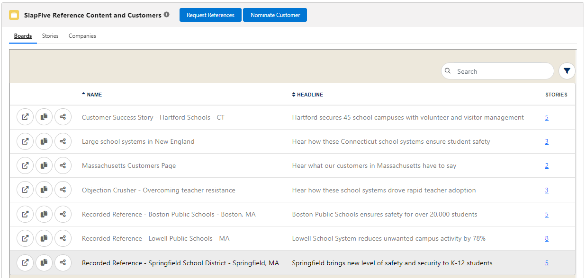

# 9. Configure Embedded Lists

This is the **SlapFive Reference Content and Customers** component, which we also call the _embedded lists of SlapFive objects_. It contains embedded lists of SlapFive Boards, Stories, and Companies. This component can be placed on the Opportunity and Account page layouts.

## Configure how an Embedded List displays

Go to **Setup** > **Custom Code** > **Custom Metadata Types.**

Find **SlapFive Object Reference** in the list and click on **Manage Records.**

In the list of **SlapFive Object References**, click on **Edit** next to **Boards**, **Stories**, or **Companies** to bring up the edit page for that embedded list. We will use Boards as an example:

<figure><figcaption>
Configure the Boards embedded list
</figcaption></figure>

Since the SlapFive Salesforce App is a managed package, you can only edit these fields:

* [ ] **Embedded URL:** you can append to this URL as described in the section **Filter Boards list to only show Boards you want to appear in Salesforce** below.
* [ ] **Is Active:** Uncheck this field if you want to hide the Boards tab and embedded list.

If you want to change the **Label** of the tab for any embedded list or change the **Order** in which the tab appears from left to right, you need to Clone the Custom Metadata Type as described next.

## Change the Labels and Order of the SlapFive object tabs and embedded lists

In the list of **SlapFive Object References**, click the Label of the SlapFive object, and click the **Clone** button. You can change any field in the cloned SlapFive object. When you make it Active, remember to edit the original SlapFive Object Reference to make it inactive.

## Filter the Boards list to only show Boards you want to appear in Salesforce

To filter the list of Boards to only show those that you have flagged in SlapFive to appear in Salesforce:

1. Go to **Setup** > **Custom Code** > **Custom Metadata Types.**
2. Bring up the **Edit** page for **Boards**.
3. Append the **Embedded URL** field to be: _/client/boards/embed?custom\_showInSalesforce=Yes_

In SlapFive, if you haven't already:

1. Go to the **Templates** used by any Boards you want to appear, and add a Custom Field to that template called _Show in Salesforce_.
2. Go to the **Boards** tab, and for any Boards you want to appear in Salesforce, go to the Custom Fields tab and enter _Yes_ into the **Show in Salesforce** field.

## Filter the Stories list to only show Stories you want to appear in Salesforce

To filter the list of Stories to only show those that you have flagged to appear in Salesforce:

1. Go to **Setup** > **Custom Code** > **Custom Metadata Types.**
2. Bring up the **Edit** page for **Stories**.
3. Append the **Embedded URL** field to be: _/client/stories/embed_?_dynamicField\_showInSalesforce=Yes_

In SlapFive, if you haven't already:

1. Go to **Client Settings** and add a Dynamic Field to the Stories entity called _Show in Salesforce_, with a **Type** of **YESNO**.
2. Go to the **Stories** tab, and for any Stories you want to appear in Salesforce, turn on the Dynamic Field **Show in Salesforce**.

## Change the component label

To change the label of the embedded lists component from **SlapFive Reference Content and Customers** to a name of your choosing:

Go to **Setup > User Interface > Custom Labels**.

Click **Edit** next to **SlapFive Object Ref**.

Type in your desired text in the **Value** field and click Save.

**NOTE:** if you have already added the Custom Component to a Page Layout, you may have to remove it and re-add it for the Tab change to take effect.

## Change the top-level tab label

To change the label of the top-level Tab that the embedded lists appear on from **SlapFive Reference Content and Customers** to a name of your choosing:

Go to **Setup > User Interface > Tabs.**

For Lightning, click **Edit** next to label **SlapFive Reference Content and Customers**. For Classic, click **Edit** next to label **SlapFive Reference Content and Customers (Classic)**.

Type in your desired text in the **Tab Label** field and click Save.

## Add component to page layouts

To add the embedded lists of SlapFive objects to the Page Layout of any Salesforce object, such as Opportunity:

Go to the page to which you want to add the embedded lists, click the **Setup** icon, and click **Edit Page**.

Scroll down to the **Custom Components** and drag and drop the SlapFive\_References component to the desired location.
