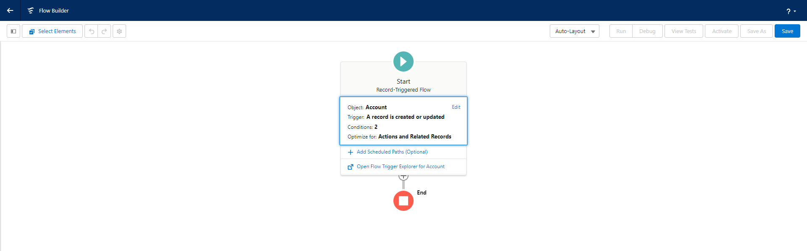

# Select Salesforce objects and fields to synch

Your Salesforce Contact and Account objects likely receive thousands of record updates a day. You don't want every record update to trigger the data synch with SlapFive. Fortunately, Salesforce lets you use Outbound Messages and Flows to determine which fields to monitor for changes, and which fields to pass to SlapFive.


**NOTE:** Before doing this step, you should have already worked with your SlapFive CSM to fill out your Salesforce <--> SlapFive data mapping matrix. You should also request the Endpoint URL needed for the Outbound Message from your SlapFive CSM.


These instructions show you how to do this for the Salesforce Account object. You can mirror these steps for Salesforce Contact and other objects.

## 1. Create a new Outbound Message

* [ ] Go to **Setup** > **Process Automation** > **Workflow Actions** > **Outbound Messages** and click the **New Outbound Message** button.&#x20;
* [ ] In the **Object** dropdown list, select **Account** and click **Next**.

<figure><figcaption></figcaption></figure>

When creating the new Outbound Message:

* [ ] **Name:** type the name _Account Creates/Updates SlapFive Company_ if setting this up for the Account object. Type the name _Contact Creates/Updates SlapFive Member_ if setting this up for the Contact object.
* [ ] **Endpoint URL:** SlapFive will provide you with this URL.
* [ ] **User to send as:** select your integration user record that has read/write access to Accounts.
* [ ] **Account fields to send:** from the **Available Fields** box, select all Account fields that you want to either monitor for changes, synchronize with SlapFive, or both, and add them to the **Selected Fields** box. When in doubt, include the field.

Click the **Save** button.

## 2. Create a Flow

* [ ] Go to **Setup** > **Process Automation** > **Flows** and click the **New Flow** button.
* [ ] Select the **Record-Triggered Flow** box and click **Create**.

<figure><figcaption>
Configure the Flow
</figcaption></figure>

When creating the new Flow:

* [ ] **Object:** Select **Account** from the dropdown list.
* [ ] **Trigger the Flow when:** \
  If you are synchronizing record changes on an ongoing basis, select **A record is created or updated**. \
  If you only want to send new Accounts to SlapFive, select **A record is created**.

Scroll down to the **Set Entry Conditions** section of the page.

<figure><figcaption>
Set Entry Conditions
</figcaption></figure>

In the **Set Entry Conditions** section:

* [ ] **Condition Requirements:** in most cases, you will select **Any Condition is Met (OR)**. This allows you to select all the fields that you want to monitor for changes, and apply OR logic so that if any one of them changes, the data synchronization will run.
* [ ] For fields that you want to update SlapFive any time the value of that field changes:
  * [ ] **Field:** select the field name.
  * [ ] **Operator:** select **Is Changed**.
  * [ ] **Value:** select **True**.
* [ ] If you only want the data synch to run when a field is set to a specific value:
  * [ ] **Field:** select the field name.
  * [ ] **Operator:** select **Equals**.
  * [ ] **Value:** type the value that will trigger the data synch. If this is a Yes/No field, select True or False respectively.

When done entering Entry Conditions, scroll down the page. To complete the setup, check the **Actions and Related Records** box and click **Done**.

## 3. Add the Outbound Message to the Flow

<figure><figcaption>
Flow Builder
</figcaption></figure>

You will now see the visual Flow Builder screen. Click the **+** button (Add Element) that is right above the red End icon. In the pop-up, and under the **Interaction** header, select **Action**.

<figure><figcaption>
New Action window
</figcaption></figure>

In the Category list on the left, click **Outbound Message,** then in the Action list, select the Outbound Message you created in the Create a new Outbound Message step, which will be _Account Creates/Updates SlapFive Company_ or _Contact Creates/Updates SlapFive Member._

<figure><figcaption>
New Action window
</figcaption></figure>

In the **Label** field, type _Account Creates/Updates SlapFive Company_ if this is for the Account object or _Contact Creates/Updates SlapFive Member_ if this is for the Contact object, and then click **Done**.

<figure><figcaption>
Flow Builder with Action added
</figcaption></figure>

Click the Save button.

<figure><figcaption>
Save the Flow
</figcaption></figure>

In the **Flow Label** field, type _Account Creates/Updates SlapFive Company_ if this is for the Account object or _Contact Creates/Updates SlapFive Member_ if this is for the Contact object, and click **Save**.

<figure><figcaption>
Activate the Flow
</figcaption></figure>

Click the **Activate** button.
